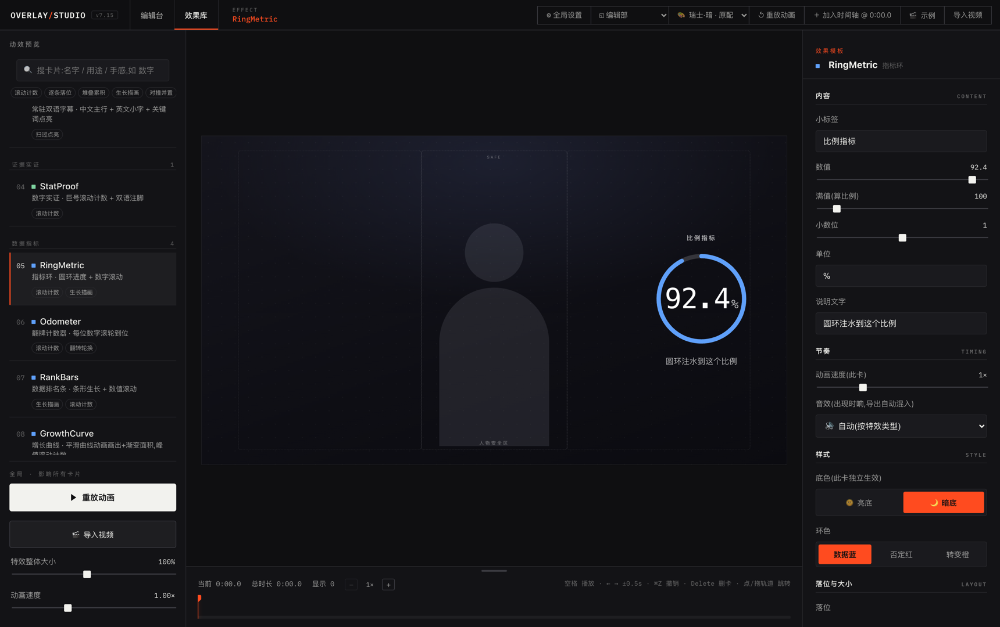

<!--
【此文件经过构建改写】它和上游源码不完全一致,你的改动需要手工搬运。
在这里改的东西,下次发布时不会自动跟着走。
-->
# Overlay Studio

**给口播视频加动效层的免费工作台。** 动效卡提前做好、调好、验证过,AI 只负责挑卡和对时间——不用再抽盲盒、反复重来。每个元素你都能自己改,导出透明动效层直接进剪映,原片一帧不压。



<p align="center"><sub>左:20 张动效卡任你挑 · 中:改完立刻看到效果 · 右:位置、大小、颜色、字体、快慢,都在这儿改</sub></p>

## 它解决什么问题

让 AI 帮你做视频动效,三件事一定会遇到:说改个颜色,它把布局也动了;改一次,等十分钟;token 哗哗地烧,这次是这个风格,下次又是另一个风格。**你想要的是改一下,它给你的是重新抽一次。**

Overlay Studio 的解法:动效**提前**做好——20 张卡,每张都调好、验证过,躺在库里;AI 只干一件事:读你的字幕,决定哪句话、配哪张卡、几秒进、几秒出。**它不再现场发挥,它只从做好的卡里挑。**

之后所有修改都在编辑台上做:位置、大小、颜色、字体、快慢,想改哪个改哪个,其他地方一个像素不变,五秒见效,零 token。

> **大模型不再抽卡;风格由你定制,效果由你编辑;token 只花一次。**

## 特性

- **20 种动效卡**:章节进度条、双语字幕层、要点钉板、数字/圆环/计数器、双栏对比、金句定格、步骤时间线、术语卡、界面标注、文字进场、人物名牌、运镜与终端演示 —— 覆盖全部 12 个用途分组,足够完整做出一期视频
- **可视化编辑台**:实时预览、时间轴、参数面板;拖动、缩放、换色、换卡都是滑杆和下拉,不用碰代码
- **AI 语义编排**:把 SRT 字幕稿交给 AI(配套 skill),按语义自动生成整期编排 JSON,时间轴对齐到句。**编排质量跟你用的模型强弱有关** —— 卡片和导出是固定的,选卡分段是 AI 判断出来的
- **编排体检器**:自动检查占位文案、时间越界、快闪、空白段等问题;警告可一键忽略,你的决定永远最大
- **透明层导出**:无头 Chrome 逐帧渲染,输出 **29.97fps(NTSC)** 透明 MOV/WebM,拖进剪映盖在原片上,零转换零对位
- **一份 JSON 就是整期视频**:可 diff、可手改、可复用;换配色、换字体、换风格都是改一个字段

## 快速开始(3 分钟)

需要两样:[Node.js](https://nodejs.org/) ≥ 20,和 **ffmpeg**(导出时用;不装也能预览,但导不出成片)。

```bash
brew install ffmpeg                      # macOS
winget install --id Gyan.FFmpeg -e       # Windows(PowerShell)
```

```bash
git clone https://github.com/jeszhou/overlay-studio.git
cd overlay-studio/motion-playground
npm install
npm run dev
```

打开 `http://localhost:5177`,点顶栏 **「🎬 示例」**——一套 28 秒、10 张卡的演示编排会载入时间轴,按空格播放。不需要准备任何素材。

然后随便点一张卡,在右边改改它的颜色、大小、出现时间,你就明白这个工具是怎么回事了。

> 装不动、或者想要一步步照着抄的版本(含 ffmpeg 装 PATH、国内镜像、字体怎么放),
> 见 **[安装指南](安装指南.md)** —— Windows 和 macOS 都覆盖。

## 用你自己的视频(完整工作流)

```
你的口播视频
  → 导出 SRT 字幕(剪映/Whisper 都行)
  → AI 生成编排 JSON(配套 skill,token 只花这一步)
  → Studio 导入:预览、手调、体检
  → 导出透明 MOV
  → 剪映里盖在原片上,完成
```

1. **拿到 SRT**:剪映"识别字幕"后导出,或用 Whisper 转写
2. **AI 编排**:仓库已内置 `overlay-fx-generator` skill。把**整个 `overlay-studio` 仓库根目录**交给你使用的 Agent,再说“根据 SRT 生成动效”,得到 `xxx-overlay.json`。不要只打开里面的 `motion-playground` 文件夹
3. **导入打磨**:Studio 里拖入 JSON 和视频,逐卡微调;左下角体检浮窗会提示可能的问题,不同意就点忽略
4. **导出**:点「⬇ 导出透明 MOV」,成品在 `exports/output/`,拖进剪映置顶轨道即可

> 每一步的细节(SRT 怎么导、H.264 怎么转、卡片怎么调、导出参数怎么选),
> 见 **[使用指南](motion-playground/使用指南.md)**。

同一份 Skill 已生成四个项目级入口,不同 Agent 会自动读取自己认识的目录:

| Agent | Skill 入口 |
|---|---|
| Claude Code | `.claude/skills/overlay-fx-generator/` |
| Codex 及支持通用 Agent Skills 的工具 | `.agents/skills/overlay-fx-generator/` |
| CodeBuddy / WorkBuddy Enterprise | `.codebuddy/skills/overlay-fx-generator/` |
| WorkBuddy 桌面版 | `.workbuddy/skills/overlay-fx-generator/` |

四个入口由构建自动同步,内容必须一致。可在 `motion-playground` 里运行
`npm run check:agent-skills` 检查;看到“4 个 Agent 入口一致”才算完整。

> 每张卡分别什么时候用、要填哪些字段,见任一入口里的 `SKILL.md`。卡片表由 registry 自动生成,永远和仓库里的卡一致。

## 编排体检(lint)

```bash
# 检查一份编排:占位文案、时间越界是硬伤;快闪、空白段、叠卡是建议
npm run -s lint:overlay -- path/to/overlay.json --duration 261
```

规则阈值在 `lint-rules.default.json`(公共默认);建一份 `lint-rules.local.json`(不进 git)可覆盖成你自己的标准。在卡片上写 `"lintOff": ["规则名"]` 表示"我知道,我就要这样"——检查器永远只报告,不改你的东西。

## 字体(可选)

**仓库不附带字体文件**——中文字体的授权条款各不相同,很多标着「免费商用」的字体
并不允许「随软件再分发」。所以字体和音效一样,自己下载放进去。

1. 把 `.ttf` / `.otf` / `.woff` / `.woff2` 丢进 `motion-playground/src/assets/fonts/`
2. **字体名 = 文件名**,Studio 左栏「全局字体」下拉里自动出现
3. 同一家族多个字重时,文件名写成 `家族名-400.otf` / `家族名-700.otf` / `家族名-900.otf`,
   会合并成一个下拉项,各字重按真实字形渲染(不这么写浏览器只能伪粗,大标题会糊)

推荐 [思源黑体](https://github.com/adobe-fonts/source-han-sans)(SIL OFL 开源许可,可自由再分发)、
[站酷字体系列](https://www.zcool.com.cn/special/zcoolfonts/)、[Google Fonts](https://fonts.google.com/)。
详见该目录的 README。

**不放也能用**:下拉里没有自定义选项而已,文字用系统默认字体渲染。

## 音效(可选)

导出时可以给每张卡自动配音效,一起烤进 MOV 的音轨。**仓库不附带音效文件**——
免费音效大多允许你用在自己的视频作品里,但不允许把音频文件本身打包成素材库再分发。

自己加很简单:

1. 到 [Mixkit](https://mixkit.co/free-sound-effects/)、[Freesound](https://freesound.org/)
   之类的站下载 mp3(下载前确认许可允许你的用途)
2. 放进 `motion-playground/public/sfx/`,**文件名就是 Studio 右栏「音效」下拉里的选项值**
3. 在 `src/components/ParamsPanel.tsx` 的 `SFX_OPTIONS` 里加一行,下拉里就能选到

按 `pop-light` `pop` `click` `type` `ding` `chime` `sparkle` `rise` `whoosh` `impact`
这些名字命名,每类卡的默认音效配对(`scripts/export-frames.mjs` 的 `KIND_SFX`)就能直接生效。

**不放也能用**:找不到音效文件会自动跳过,成片照常导出,只是没有音轨。

## 目录结构

```
├── .claude/skills/        # Claude Code Skill 入口(真源)
├── .agents/skills/        # Codex / 通用 Agent Skills 入口
├── .codebuddy/skills/     # CodeBuddy / WorkBuddy Enterprise 入口
├── .workbuddy/skills/     # WorkBuddy 桌面版入口
motion-playground/
├── src/effects/          # 20 种动效卡组件(HUD 族在 hud/)
├── src/overlay/          # overlay JSON 解析、lint 检查器
├── src/components/       # 编辑台 UI(画布/时间轴/参数面板)
├── public/demo/          # 内置演示编排(🎬 示例按钮的数据)
├── scripts/              # 逐帧导出、lint CLI、卡片自检
└── lint-rules.default.json
```

## 前期投入(一次性搭建,越用越轻松)

- 前期要做的事:装好工具、建卡片库——或者直接用现成的 20 张,装好当天就能出片。搭建是一次性的,之后每期都在摊薄它:**投入一次,期期复利**。素材库越攒越多,越用越像你
- 最适合每周更新的口播/知识区创作者;更新越勤,复利越快
- 对比的 baseline 是"和大模型对话改动效工程"的工作流,不是剪映模板——两者不是同一件事
- 导出依赖本地无头 Chrome(随 puppeteer 自动安装)和 ffmpeg(macOS `brew install ffmpeg` / Windows `winget install --id Gyan.FFmpeg -e`)

## 包含什么 / 不包含什么

**包含**(能独立做完一期能发的视频):

- 完整编辑台:时间轴、画布拖拽、参数面板、撤销重做、导入导出
- **20 张动效卡**,覆盖 12 个用途分组:常驻层、证据、数据、对比、金句、步骤、
  信息结构、教程标注、文字进场、人物锚定、运镜、B-roll
- 透明动效层导出管线(29.97fps NTSC ProRes 4444 / WebM)
- 编排体检器 + 默认阈值
- AI 编排 skill:丢一份 SRT 进去直出可导入的 JSON
- 一份**中性**的偏好取值表(`我的偏好.default.md`)

**不包含**:动效卡库和审美体系只是作者的私有沉淀。本仓给的是一条能跑通的生产线,
鼓励你在同样架构上长出自己的卡片库和视觉风格。

需要完整版直接上手,或想直接用现成模板的,联系作者:
全网同名「**一页枝鸥**」 —— 抖音号 `67790100407` · 小红书号 `27401290504`

## 致谢

本项目最初的思路受 AI 博主 **茂茂AI** 的公开分享启发,在此致谢。
之后的卡片库、编辑台与导出管线为独立实现。

## 授权

**免费使用,禁止转售。**

个人、团队与公司均可免费使用;使用本软件制作的视频,版权完全归你,商用不受限。
唯一的限制是软件本身不得用于牟利 —— 不得转售、不得作为付费产品/课程/社群的交付物、
不得改造为对外提供的同类服务。

完整条款见 [LICENSE](LICENSE)(English: [LICENSE-EN](LICENSE-EN))。

本仓**不附带字体与音效文件** —— 中文字体和音效的授权条款各不相同,很多标着「免费商用」的
素材并不允许随软件再分发。获取方式见 [安装指南](安装指南.md)。
