# Overlay Studio 操作指南

> 对应 v1.1.1 的界面;每一版变了什么见 CHANGELOG.md
> 配套文档:[安装指南](安装指南.md)(怎么装) → 本文(怎么用)

装好了、能打开 `http://localhost:5177`,但不知道每个按钮干嘛用 —— 这份文档就是给这一刻的你写的。

**怎么读:** 从第 0 章跟着做一遍,三分钟就能跑通全流程,先有个整体印象。之后哪儿不明白翻哪一章,不用从头读。

每一节末尾都有一句「**做完你应该看到什么**」。看到了就是对的,没看到就回头检查那一步。

---

## 0. 三分钟跑通

不需要准备任何素材,先把整条路走一遍。

**第一步 · 打开。** 启动服务后浏览器会自动开 `http://localhost:5177`。
第一次打开 Studio 会先弹一个**授权协议门** —— 把协议滚到底,「我已阅读并同意」才会亮起来,点它进去。这个只在第一次弹,以后不弹(协议改版才会再弹一次)。

**第二步 · 载入示例。** 点顶栏右边的 **「🎬 示例」**。
一套 28 秒、10 张卡的演示编排会载进来,自带字幕稿,不需要你的视频。

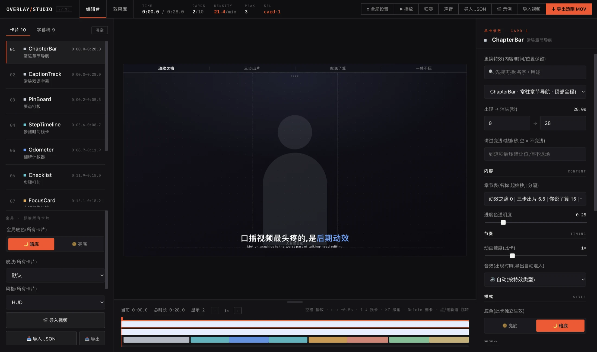

**第三步 · 播放。** 按**空格**,或点顶栏「▶ 播放」。画面里的动效会跟着时间轴跑起来。

**第四步 · 改一张卡。** 左栏是这一期的卡片清单,按时间从上到下排:

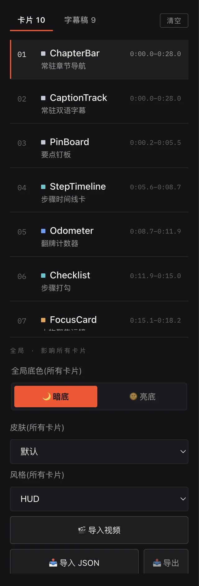

点任意一张卡,右栏立刻显示这张卡的全部参数。往下找到「样式 STYLE」那一组,随便换个颜色 —— 画面**立刻**变,不用等,不花 token。

**第五步 · 导出。** 点顶栏最右边的 **「⬇ 导出透明 MOV」**。右下角出现进度浮窗,跑完成品在 `motion-playground/exports/output/`。把它拖进剪映,盖在原片最上面一轨就行。

> **做完你应该看到什么:** `exports/output/` 里多出一个 `.mov` 文件,拖进剪映后画面是**透明底 + 动效**,底下的原片能透上来。

---

## 1. 界面五块地图

整个编辑台就五块地方,认清这五块,剩下的都是细节。

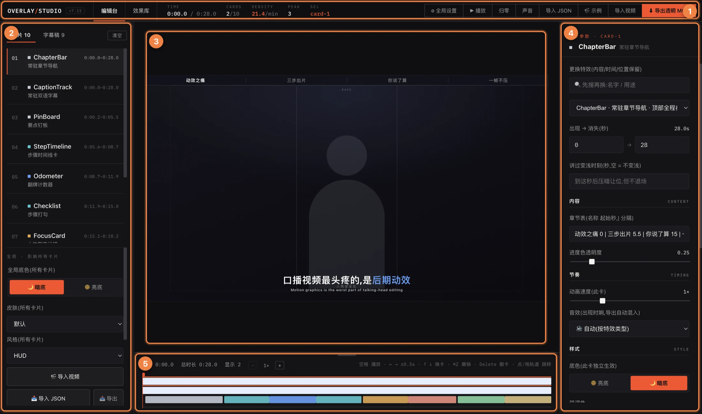

| | 区域 | 管什么 |
|---|---|---|
| **1** | **顶栏** | 模式切换、播放控制、导入导出、全局设置。**读数**也在这儿:当前时间、卡片数、密度、同屏峰值 |
| **2** | **左栏** | 编辑台模式=卡片列表 / 字幕稿;效果库模式=挑卡。**底部是全局控件**,影响所有卡片 |
| **3** | **画布** | 实时预览。所见即所得,导出就是这个样子 |
| **4** | **右栏** | **选中那一张卡**的全部参数。没选卡就是空的 |
| **5** | **时间轴** | 每张卡什么时候进、什么时候出。拖它就改时间 |

还有两个**浮窗**,不常驻,该出现的时候才出现:

- **左下角 · 体检浮窗** —— 导入编排后自动跑一遍检查,报问题
- **右下角 · 导出进度** —— 点导出后才出现,显示渲染到第几帧、还要多久

顶栏左半边那几个读数,是你判断「这期做得怎么样」的仪表盘:

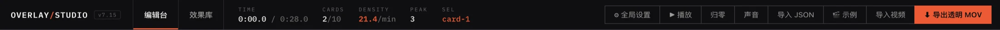

- **TIME** —— 当前时间 / 总时长
- **CARDS** —— 此刻在画面上的卡 / 总卡数
- **DENSITY** —— 每分钟几张卡。**目标 10–16**
- **PEAK** —— 同屏峰值。**建议 ≤ 4**
- **SEL** —— 选中那张卡的 ID(选了才出现)

记住一条就够:**左栏管全局,右栏管单卡。** 想改所有卡片去左边,想改这一张去右边。

> **做完你应该看到什么:** 你能指着屏幕说出这五块分别叫什么。

---

## 2. 两个模式:编辑台 / 效果库

顶栏最左边有两个标签,这是整个工具最大的一次分叉。

**「编辑台」= 做一期视频。** 时间轴、字幕稿、整条片子的编排,都在这个模式里。你 90% 的时间待在这儿。

**「效果库」= 逛卡片库。** 20 张卡分 11 组摆在这儿,单张预览、看手感、挑卡。

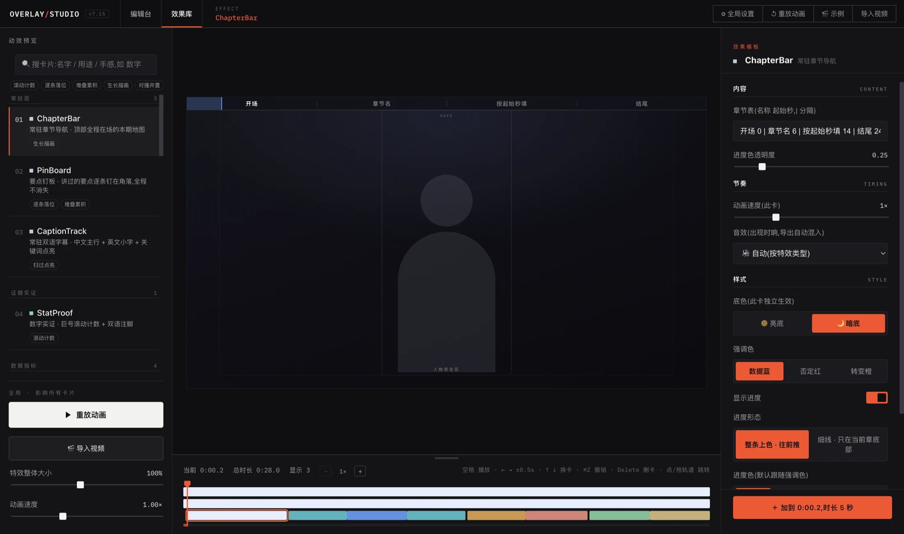

效果库里有三个找卡的办法,可以叠加用:

1. **搜索框** —— 搜名字、用途、手感都行。「数字」「引用」「步骤」这类词都能搜到
2. **标签栏** —— 搜索框下面那排小标签,点一下只看这一类,再点一下取消
3. **分组浏览** —— 11 个大组:常驻层、证据实证、数据指标、对比取舍、金句观点、步骤流程、教程标注、文字进场、人物锚定、场景·运镜、场景·B-roll

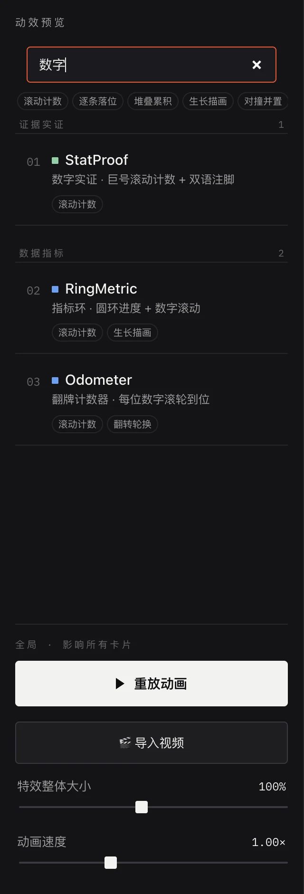

挑中一张想用,点顶栏 **「＋ 加入时间轴 @ 0:12.5」** —— 它会加在**当前时间点**上。加完自动切回编辑台。

> 在效果库里,顶栏的「▶ 播放」会变成「↺ 重放动画」,「⬇ 导出透明 MOV」则不显示 —— 导出在编辑台做。这是正常的,不是按钮丢了。

> **做完你应该看到什么:** 你能在效果库里搜到一张卡,把它加进时间轴,然后在编辑台的卡片列表最下面找到它。

---

## 3. 完整一期的流程

真做一期视频,是这么走的:

```
你的口播视频
  → 导出 SRT 字幕(剪映「识别字幕」或 Whisper)
  → 交给 AI 生成编排 JSON(配套 skill,token 只花这一步)
  → Studio 里:导入 → 预览 → 手调 → 体检
  → 导出透明 MOV
  → 剪映里盖在原片上,完成
```

### 3.1 导入视频

顶栏「导入视频」,或左栏底部「🎬 导入视频」,两个是同一个东西。
视频只是**垫在底下当参照**用的,让你知道动效会盖在人脸什么位置。它不会被导出 —— 导出的只有透明动效层。

导入后左栏底部会多出一个「**视频画面缩放**」滑杆。源片有黑边、没占满画布的时候,用它放大充满。

### 3.2 导入字幕稿

左栏切到「**字幕稿**」标签,点「导入 SRT」,或者直接把 `.srt` 文件拖进窗口。

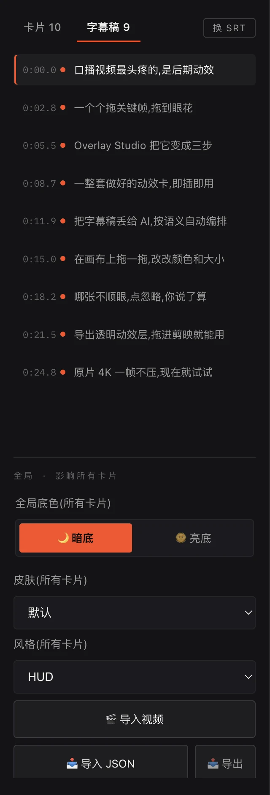

导进来之后这一栏很有用:

- **点任意一句** → 时间轴直接跳到那一秒
- **时间左边那个小圆点** → 亮的表示这句**已经有卡覆盖**,暗的表示这句还是光的

顺着往下扫一遍,哪儿有大片暗点,哪儿就是漏配的段落。

### 3.3 导入 AI 生成的编排

顶栏「导入 JSON」,或左栏底部「📥 导入 JSON」。

编排 JSON 怎么来:仓库里内置了 `overlay-fx-generator` skill。把**整个仓库根目录**交给你用的 AI Agent(不要只给 `motion-playground` 子目录),说「根据 SRT 生成动效」,它会吐一个 `xxx-overlay.json` 给你。

> 编排质量跟你用的模型强弱有关。卡片和导出是固定的,**选哪张卡、分在哪一段,是 AI 判断出来的** —— 换个更强的模型,编排会明显更准。

### 3.4 看体检结果

导入编排会**自动跑一遍体检**,发现问题就在左下角弹一个浮窗。

它查这些:占位文案没替换、时间超出视频长度、卡闪得太快、中间有大段空白、底板叠了两层……

两种级别:

- **❌ 必修** —— 大概率是错的,建议改
- **⚠️ 建议** —— 可能有更好的做法,你说了算

每条后面两个按钮:

- **定位** —— 跳到出问题的那张卡,直接改
- **忽略** —— 你决定就这么办。忽略会**写进那张卡并随 JSON 保存**,以后不再提醒

> 体检只提醒,**永远不阻断**。你的决定最大。
> 内置的演示编排本身很规范,不报问题 —— 等你自己编排的时候才会看到它。

### 3.5 逐卡打磨

这是花时间最多的一步,方法在第 4、5 章。

打磨的时候盯着顶栏的两个读数:

- **DENSITY(密度)** —— 每分钟几张卡。**目标 10–16 张/分钟**。低于 10 画面容易空,高于 16 容易糊
- **PEAK(同屏峰值)** —— 同一时刻最多几张卡同时在。**建议不超过 4**,再多就打架了

### 3.6 导出

点「⬇ 导出透明 MOV」。右下角进度浮窗会走这几个阶段:

1. **准备中(启动渲染器)**
2. **预处理素材** —— 把卡片里的视频抽成帧。长录屏这步要几分钟,正常
3. **渲染帧 x/y · 预计还需 …** —— 主要耗时在这儿
4. **合成透明 MOV** / **合成 WebM 小体积版** / **把音效混进 MOV**

出来两个文件在 `exports/output/`:

- **`.mov`** —— **29.97fps(NTSC)透明 MOV**,这是给剪映用的
- **`.webm`** —— 小体积版,发预览、发微信用

剪映里把 MOV 拖到**原片上面那一轨**就行。29.97fps 是剪映的原生帧率,零转换、零对位、原片一帧不压。

### 3.7 存档与复用

左栏底部「📤 导出」把当前编排存成 JSON。

**一份 JSON 就是整期视频。** 它可以 diff、可以手改、可以复用 —— 下一期想沿用这一期的风格,导入这份 JSON 改文案就行。

> **做完你应该看到什么:** 剪映时间轴上两轨 —— 下面原片,上面透明动效层,播放时动效正好卡在你说那句话的时候。

---

## 4. 右栏:单卡参数

在时间轴色块上、或左栏卡片列表里点一张卡,右栏就活了。

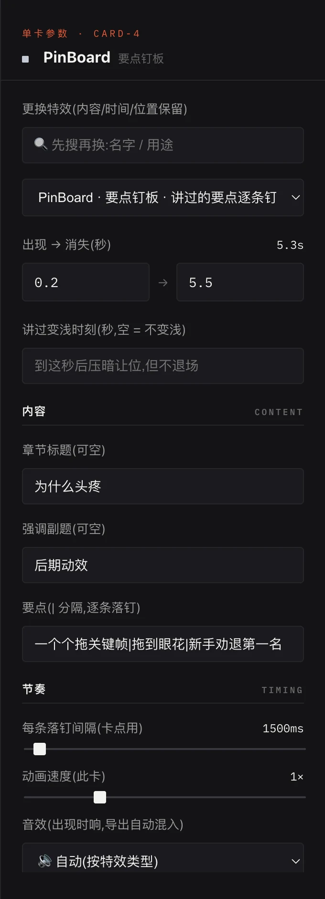

面板从上到下是固定顺序:

### 4.1 最上面三个(最常用)

**更换特效**
先在搜索框里搜,再从下拉里选。时间和落位保留,**但文案会重置成新卡的默认值** ——
换之前先把原来的文字复制出来。


**出现 → 消失(秒)**
两个数字框,精确到 0.1 秒。右上角显示这张卡的时长。
粗调用时间轴拖,精调在这儿敲数字。

**讲过变浅时刻(秒)**
填一个秒数,到这一秒之后这张卡会**压暗让位,但不退场**。
适合「这个点讲完了,但信息还得留着」的场合。填了之后下面会出现三个选项:变浅+缩小 / 只变浅 / 只缩小。留空 = 不变浅。

### 4.2 四组参数

再往下是四组,顺序固定:

| 组 | 英文 | 装什么 | 改它影响什么 |
|---|---|---|---|
| **内容** | CONTENT | 标题、正文、条目、数字、素材路径 | 这张卡**说什么** |
| **节奏** | TIMING | 动画速度、各段时长、音效 | 这张卡**多快** |
| **样式** | STYLE | 颜色、字号、窗形、底色、开关 | 这张卡**长什么样** |
| **落位与大小** | LAYOUT | 左右偏移、上下偏移、贴哪边、贴哪个角、缩放 | 这张卡**在画面哪儿、多大** |

不是每张卡四组都有 —— 纯文字卡可能没有「内容」以外的复杂项。**有就显示,没有就不显示**,不用找。


### 4.3 最下面:叠放 LAYER

同一时刻有多张卡时才出现。**上移一层 / 下移一层**,决定谁压在谁上面。
只在「同时出现的卡」之间挪 —— 跟不见面的卡换先后没有意义,所以挪到头按钮会自动变灰。

> **做完你应该看到什么:** 你改右栏任何一个滑杆,画布**立刻**变,而且**只有那一处变**,别的地方一个像素不动。

---

## 5. 时间轴

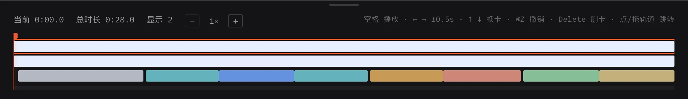

**信息条**(左边):当前时间 / 总时长 / 显示几张卡。

**缩放**:`−` `+` 按钮,或者 **⌘ + 滚轮**。轴拉长了才好精确拖拽。

**改高度**:把鼠标放在时间轴**最上沿**,上下拖 —— 卡多的时候拉高,能一眼看全。

**色块操作**(每张卡一条):

| 动作 | 效果 |
|---|---|
| 点色块 | 选中这张卡,右栏切过去 |
| **拖色块中间** | 整张卡平移(时长不变) |
| **拖色块左右边缘** | 改起始 / 结束时间(另一端不动) |
| **选中后按 Delete** | 删除这张卡 |
| 点 / 拖空白轨道 | 跳到那个时间 |

**记不住就看提示条** —— 时间轴右上角一直写着:`空格 播放 · ←→ ±0.5s · ⌘Z 撤销 · Delete 删卡 · 点/拖轨道 跳转`。

> 所有时间轴上的改动都能 **⌘Z 撤销**,放心拖。

> **做完你应该看到什么:** 拖动一张卡的色块,顶栏的 DENSITY 读数跟着变。

---

## 6. 全局设置:一次改所有卡

「我想让整期视频的主色统一一下」—— 这类需求**不要一张一张改**,有两个地方专门干这个。

### 6.1 顶栏「⚙ 全局设置」

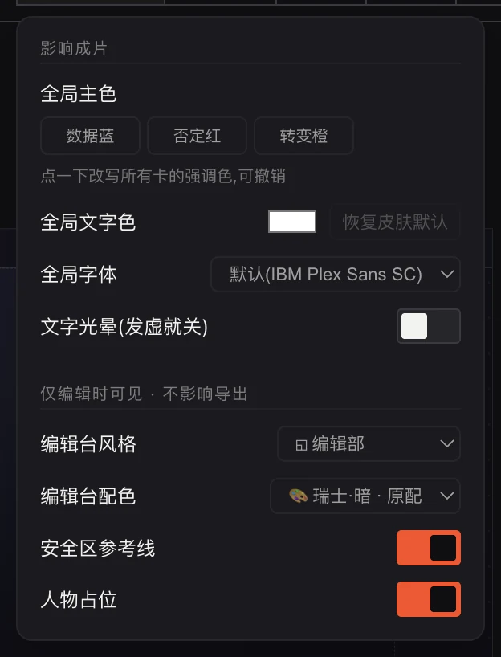

弹层分两段,标题写得很清楚。

**「影响成片」** —— 会进导出的:

- **全局主色** —— 点一个色块,**所有卡的强调色一次改写**。可以 ⌘Z 撤销
- **全局文字色** —— 取色器改,「恢复默认」还原
- **全局字体** —— 默认 IBM Plex Sans SC,装了自定义字体会出现在这个下拉里
- **文字光晕** —— 字发虚就把它关掉(见第 8 章)

**「仅编辑时可见 · 不影响导出」** —— 只是给你看的参考线:

- **安全区参考线** —— 画面边缘的安全边距,避免字被平台 UI 挡住
- **人物占位** —— 画布中间那个灰色人形,提示「这块地方将来是人,别把字压上去」

### 6.2 左栏底部「全局 · 影响所有卡片」

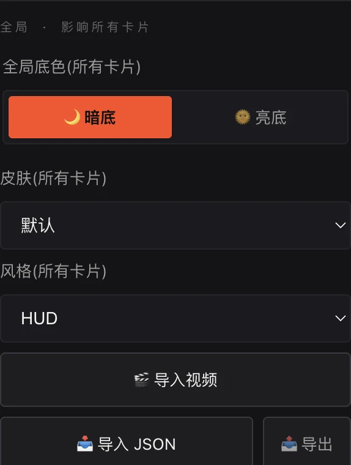

- **全局底色** —— 🌙 暗底 / 🌞 亮底,一键切。单张卡还能在右栏单独覆盖
- **特效整体大小** —— 50%–160%,所有卡一起缩放
- **动画速度** —— 0.5×–2×,所有卡一起快慢。**导出同步生效**
- **口播视频 · 运镜卡共用** —— 传一次,运镜卡(focus-card)导出时共用,按时间轴自动对位,不用自己剪时间段。**需要 H264 编码**

### 6.3 别搞混:顶栏还有两个下拉,那两个不影响成片

顶栏中间那两个下拉 —— **◱ 风格** 和 **🎨 配色** —— 改的是**编辑台自己长什么样**(圆角、边框、控件颜色),跟导出画面**一点关系都没有**。纯粹是让你用着舒服。任何配色都能配任何风格,带「· 原配」标记的是这个风格的默认搭配。

> **做完你应该看到什么:** 点一下全局主色的某个色块,画布里**所有**卡的强调色一起变了;⌘Z 一按,全变回去。

---

## 7. 快捷键

| 键 | 编辑台 | 效果库 |
|---|---|---|
| **空格** | 播放 / 暂停 | 重放动画 |
| **↑ ↓** | 上一张 / 下一张卡(走时间轴上的卡,播放头跟着跳) | 上一张 / 下一张(走列表顺序) |
| **← →** | 快退 / 快进 **0.5 秒** | 挪「加入时间轴」的插入位置 |
| **Shift + ← →** | 快退 / 快进 **3 秒** | 同上,大步 |
| **⌘Z** | 撤销 | — |
| **⇧⌘Z** | 重做 | — |
| **Delete / Backspace** | 删除选中的卡 | — |
| **⌘ + 滚轮** | 缩放时间轴 | — |

> 在输入框里打字时快捷键自动让位,不会误触发。
>
> **一个例外:效果库的搜索框。** 搜完卡光标还留在框里,这时候正是最想换卡的时刻,
> 所以搜索框里按 ↑↓ 直接换卡,不用先点一下别处。其余输入框(参数面板那些数字框)
> 照旧让位 —— 那儿的 ↑↓ 是加减数值。

---

## 8. 常见问题

**点了导出,报错或者没反应**
八成是 **ffmpeg 没装**。不装也能预览,但导不出成片。
macOS:`brew install ffmpeg`;Windows(PowerShell):`winget install --id Gyan.FFmpeg -e`。
详见[安装指南](安装指南.md)。

**启动时报「5177 被占了」**
这是**故意的**,不会自动换到 5178。因为浏览器的存档按端口隔离,换了端口你的编排会「看起来丢了」,启动器也会打不开。
把占着 5177 的程序关掉,或者找出是谁占着:`lsof -nP -iTCP:5177 -sTCP:LISTEN`。

**字看着发虚、糊**
关掉**文字光晕**:顶栏「⚙ 全局设置 → 文字光晕」。光晕在暗画面上好看,在亮画面或小字上就发虚。

**亮画面上字看不清**
在右栏把这张卡的底色调深,或者换一张自带底板的卡(pin-board、term-card 这类)。

**动效太密 / 太挤**
看顶栏读数:**DENSITY 目标 10–16 张/分钟**,**PEAK 建议 ≤ 4**。
超了就删卡,或者用「讲过变浅时刻」让先出现的卡压暗让位,而不是硬塞。

**体检报了一堆问题,必须全改吗**
不必须。**❌ 必修**建议改,**⚠️ 建议**你说了算。点「忽略」就写进那张卡,以后不再提醒 —— 你的决定永远最大。

**导出很慢**
正常。它是逐帧渲染的:先抽帧、再一帧一帧渲、最后合成。长录屏光「预处理素材」就要几分钟。右下角进度浮窗里的「预计还需」是按实际速度算的,可以信。

**改错了想退回去**
**⌘Z**。时间轴上的改动、全局主色改写,都能撤销。

**换了一期视频,想沿用上一期的风格**
导入上一期的 JSON,改文案就行。**一份 JSON 就是整期视频。**

---

## 附:一页速查

**做一期视频** = 导视频 → 导 SRT → 导 AI 编排 JSON → 看体检 → 逐卡调 → 导出 MOV → 剪映盖上去

**改一张卡** → 右栏
**改所有卡** → 左栏底部 + 顶栏 ⚙ 全局设置
**改时间** → 时间轴拖(粗调)/ 右栏敲数字(精调)
**找卡** → 效果库,搜名字 / 用途 / 手感
**后悔了** → ⌘Z

**两个读数别超标**:密度 10–16 张/分,同屏峰值 ≤ 4
